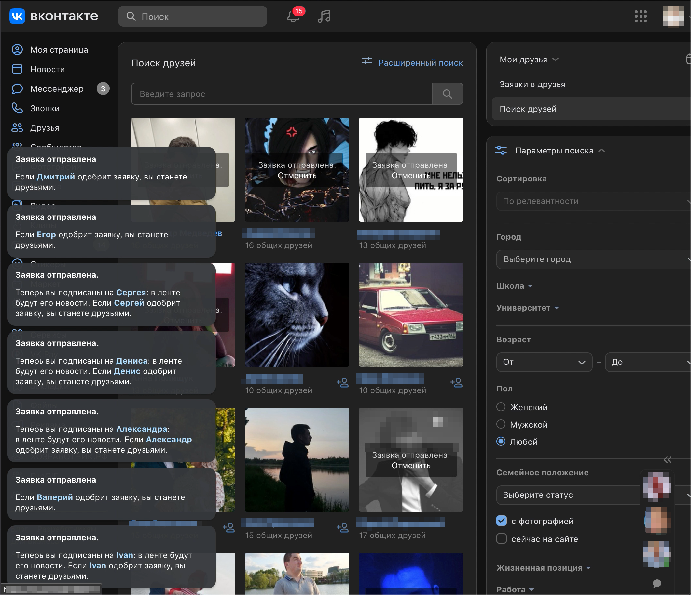
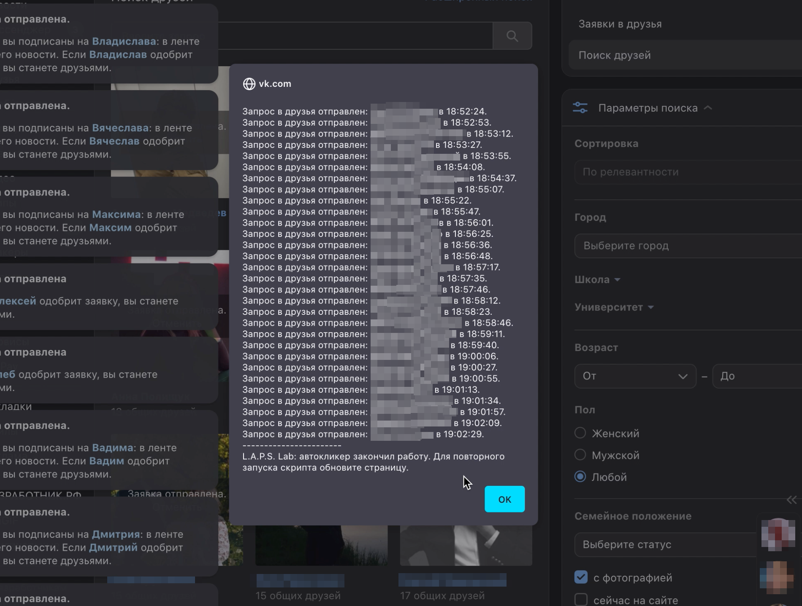

# VK recomended friends auto clicker
__Автокликер для добавления друзей Вконтакте__
by L.A.P.S. Lab

## Возможности алгоритма

1.Имитация человеческого поведения

- прокликивает ссылки в случайной последовательности
- случайный интервал между кликами (задаются параметрами, по-умолчанию - от 10 до 15 секунд между кликами)
- ограничено количество кликов (задается параметрами - по умолчанию 30)
- логи действий в консоли браузера и localStorage (ожидается)

§ 2.Доступно несколько режимов работы

- из консоли браузера
- Firefox GreeseMonkey UserScript
- Chrome расширение(ожидается)

## Как это работает?

Скрипт запускается в консоли, в расширении браузера или как выделенное расширение браузера и предлагает скликать найденное количество специфических ссылок на странице. В выдаче страницы по умолчанию 30 рекоммендаций.

После запуска скрипт:

- составляет массив ссылок из всех найденных по классу
- перемешивает ссылки в массиве
- составляет список отложенных задач типа _element.click()_
- выполняет задачи
- отчитывается о выполнении

Скрипт предполагает запуск при каждой перезагрузке страницы.

